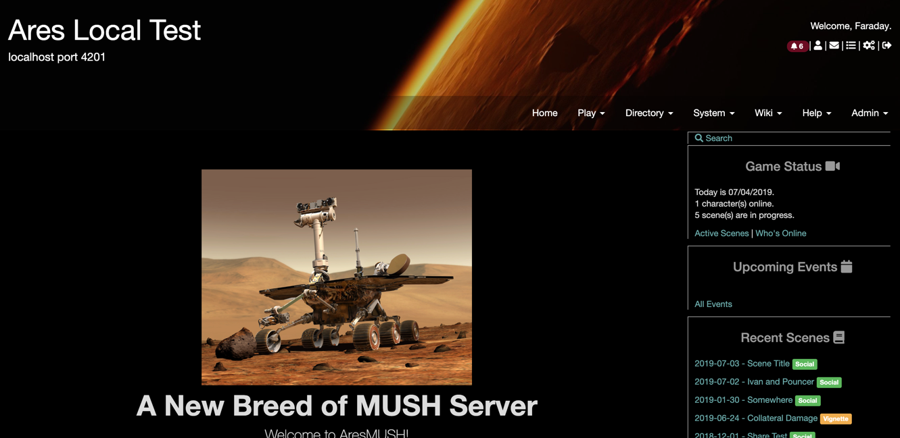
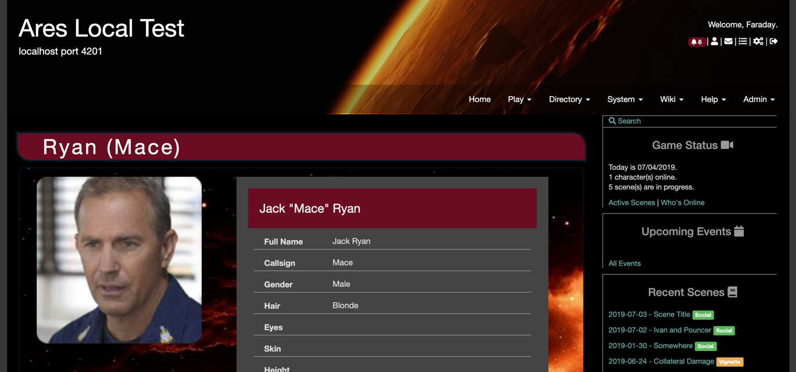

This is an alternate AresMUSH theme with a dark background. Since the default Ares theme is also dark now, it's probably not very useful.

## Installing

Use `theme/install <github url>` with an admin character in-game.

> **Note:** Doing this will overwrite your current web portal theme. The files will be backed up to the `aresmush/theme_archive` folder if you need to get them back.

## Screenshots

## License

Same as [AresMUSH](https://aresmush.com/license).